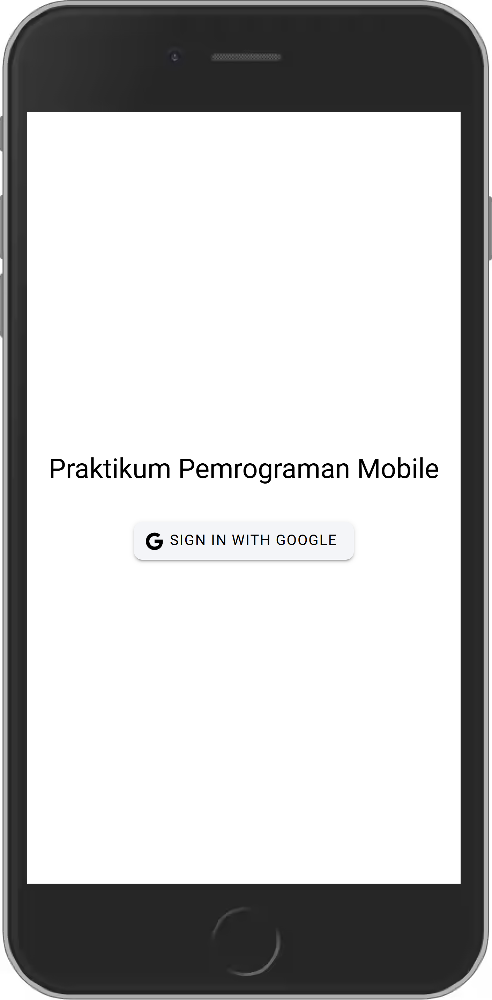
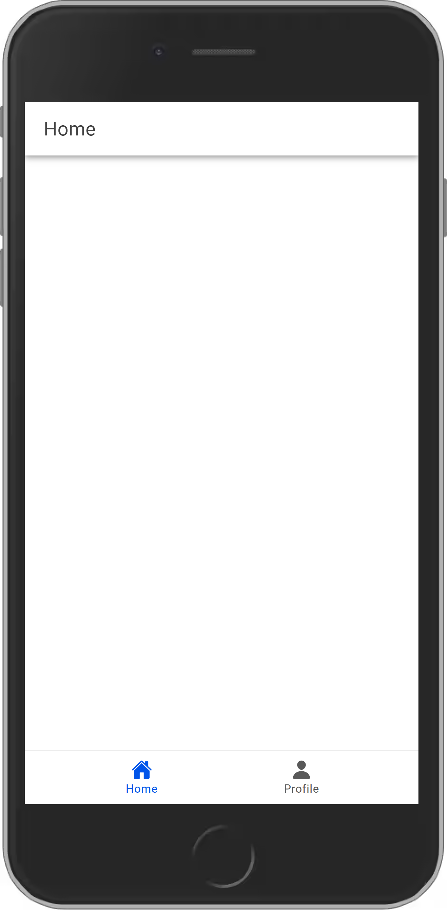
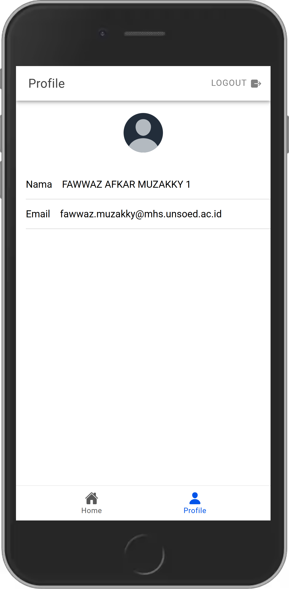

# Autentikasi Login dengan Google di Aplikasi Ionic Vue

## Langkah-langkah

### 1. Konfigurasi Firebase
Pertama, konfigurasi Firebase, Buat file `firebase.ts` di folder `src/utils` dan tambahkan konfigurasi Firebase:

```typescript
// src/utils/firebase.ts
import { initializeApp } from "firebase/app";
import { getAuth, GoogleAuthProvider } from 'firebase/auth';

const firebaseConfig = {
    apiKey: "API_KEY",
    authDomain: "AUTH_DOMAIN",
    projectId: "PROJECT_ID",
    storageBucket: "STORAGE_BUCKET",
    messagingSenderId: "MESSAGING_SENDER_ID",
    appId: "APP_ID"
};

const firebase = initializeApp(firebaseConfig);
const auth = getAuth(firebase);
const googleProvider = new GoogleAuthProvider();

export { auth, googleProvider };
```

### 2. Setup Pinia Store untuk Autentikasi
Buat store Pinia untuk mengelola status autentikasi pengguna di `src/stores/auth.ts`:

```typescript
// src/stores/auth.ts
import { defineStore } from 'pinia';
import { ref, computed } from 'vue';
import router from '@/router';
import { auth } from '@/utils/firebase';
import { GoogleAuthProvider, onAuthStateChanged, signInWithCredential, signOut, User } from 'firebase/auth';
import { GoogleAuth } from '@codetrix-studio/capacitor-google-auth';
import { alertController } from '@ionic/vue';

export const useAuthStore = defineStore('auth', () => {
    const user = ref<User | null>(null);
    const isAuth = computed(() => user.value !== null);

    const loginWithGoogle = async () => {
        try {
            await GoogleAuth.initialize({
                clientId: '556382459801-tdkrvbflmkf7jo30rh9qpa7eqb9iq4je.apps.googleusercontent.com',
                scopes: ['profile', 'email'],
                grantOfflineAccess: true,
            });

            const googleUser = await GoogleAuth.signIn();
            const idToken = googleUser.authentication.idToken;
            const credential = GoogleAuthProvider.credential(idToken);
            const result = await signInWithCredential(auth, credential);
            user.value = result.user;
            router.push("/home");
        } catch (error) {
            console.error("Google sign-in error:", error);
            const alert = await alertController.create({
                header: 'Login Gagal!',
                message: 'Terjadi kesalahan saat login dengan Google. Coba lagi.',
                buttons: ['OK'],
            });
            await alert.present();
            throw error;
        }
    };

    const logout = async () => {
        try {
            await signOut(auth);
            await GoogleAuth.signOut();
            user.value = null;
            router.replace("/login");
        } catch (error) {
            console.error("Sign-out error:", error);
            throw error;
        }
    };

    onAuthStateChanged(auth, (currentUser) => {
        user.value = currentUser;
    });

    return { user, isAuth, loginWithGoogle, logout };
});
```

### 3. Implementasi Halaman Login
Buat halaman login di `src/pages/LoginPage.vue`:

```vue
<template>
    <ion-page>
        <ion-content :fullscreen="true">
            <div id="container">
                <ion-text style="margin-bottom: 20px; text-align: center;">
                    <h1>Praktikum Pemrograman Mobile</h1>
                </ion-text>
                <ion-button @click="login" color="light">
                    <ion-icon slot="start" :icon="logoGoogle"></ion-icon>
                    <ion-label>Sign In with Google</ion-label>
                </ion-button>
            </div>
        </ion-content>
    </ion-page>
</template>

<script setup lang="ts">
import { IonContent, IonPage, IonButton, IonIcon, IonText, IonLabel } from '@ionic/vue';
import { logoGoogle } from 'ionicons/icons';
import { useAuthStore } from '@/stores/auth';

const authStore = useAuthStore();

const login = async () => {
    await authStore.loginWithGoogle();
};
</script>

<style>
#container {
    display: flex;
    flex-direction: column;
    justify-content: center;
    align-items: center;
    height: 100%;
}

ion-button {
    --border-radius: 8px;
}
</style>
```

### 4. Implementasi Halaman Profil
Buat halaman profil di `src/pages/ProfilePage.vue`:

```vue
<template>
    <ion-page>
        <ion-header :translucent="true">
            <ion-toolbar>
                <ion-title>Profile</ion-title>
                <ion-button slot="end" fill="clear" @click="logout" style="--color: gray;">
                    <ion-icon slot="end" :icon="exit"></ion-icon>
                    <ion-label>Logout</ion-label>
                </ion-button>
            </ion-toolbar>
        </ion-header>
        <ion-content :fullscreen="true">
            <div id="avatar-container">
                <ion-avatar>
                    
                </ion-avatar>
            </div>
            <ion-list>
                <ion-item>
                    <ion-input label="Nama" :value="user?.displayName" :readonly="true"></ion-input>
                </ion-item>
                <ion-item>
                    <ion-input label="Email" :value="user?.email" :readonly="true"></ion-input>
                </ion-item>
            </ion-list>
            <TabsMenu />
        </ion-content>
    </ion-page>
</template>

<script setup lang="ts">
import { IonContent, IonHeader, IonPage, IonTitle, IonToolbar, IonInput, IonItem, IonList, IonLabel, IonIcon, IonButton, IonAvatar } from '@ionic/vue';
import { exit } from 'ionicons.icons';
import { computed, ref } from 'vue';
import TabsMenu from '@/components/TabsMenu.vue';
import { useAuthStore } from '@/stores/auth';

const authStore = useAuthStore();
const user = computed(() => authStore.user);

const logout = () => {
    authStore.logout();
};

const userPhoto = ref(user.value?.photoURL || 'https://ionicframework.com/docs/img/demos/avatar.svg');

function handleImageError() {
    userPhoto.value = 'https://ionicframework.com/docs/img/demos/avatar.svg';
}
</script>

<style scoped>
#avatar-container {
    display: flex;
    justify-content: center;
    align-items: center;
    margin: 20px 0;
}

#avatar-icon {
    width: 80px;
    height: 80px;
}
</style>
```

### Penjelasan Proses Autentikasi Login

1. **Inisialisasi Firebase**:
    - Pertama, kita perlu mengatur Firebase di aplikasi kita. Caranya dengan membuat file bernama `firebase.ts` di dalam folder `src/utils`.
    - Di dalam file ini, kita akan mengatur konfigurasi Firebase menggunakan `initializeApp` dari Firebase SDK. Selain itu, kita juga akan menginisialisasi `auth` dan `googleProvider` yang akan digunakan untuk login dengan Google.

2. **Setup Pinia Store untuk Autentikasi**:
    - Selanjutnya, kita buat store Pinia di `src/stores/auth.ts` untuk mengelola status login pengguna.
    - Di dalam store ini, ada state `user` yang menyimpan informasi pengguna dan `isAuth` untuk mengecek apakah pengguna sudah login atau belum.
    - Ada fungsi `loginWithGoogle` yang digunakan untuk memulai proses login dengan Google. Fungsi ini akan menginisialisasi GoogleAuth, meminta pengguna untuk login, dan mendapatkan `idToken`.
    - `idToken` ini kemudian digunakan untuk membuat kredensial Google yang digunakan untuk login ke Firebase dengan `signInWithCredential`.
    - Jika login berhasil, informasi pengguna akan disimpan di state `user` dan pengguna akan diarahkan ke halaman `/home`.
    - Ada juga fungsi `logout` yang digunakan untuk keluar dari aplikasi, menghapus status login pengguna, dan mengarahkan pengguna kembali ke halaman login.

3. **Implementasi Halaman Login**:
    - Kita buat halaman login di `src/pages/LoginPage.vue`.
    - Di halaman ini, ada tombol yang akan memanggil fungsi `login` dari store Pinia ketika diklik.
    - Fungsi `login` ini akan memanggil `loginWithGoogle` dari store untuk memulai proses login.

4. **Implementasi Halaman Profil**:
    - Kita buat halaman profil di `src/views/ProfilePage.vue`.
    - Di halaman ini, kita akan menampilkan informasi pengguna seperti nama dan email yang diambil dari state `user` di store Pinia.
    - Halaman ini juga memiliki tombol logout yang akan memanggil fungsi `logout` dari store untuk keluar dari aplikasi.


### Screenshot

Berikut adalah screenshot dari aplikasi yang telah selesai:




